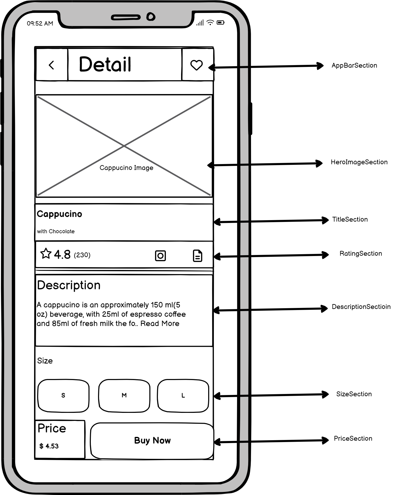
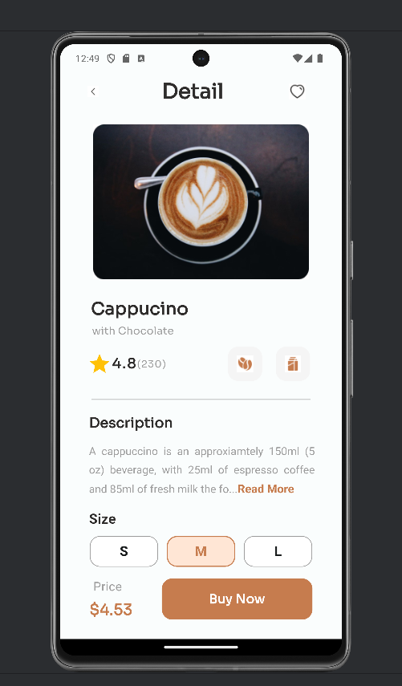

# Cappuccino Homepage Flutter App

## Table of Contents
- [Description](#Description)
- [Features](#Features)
- [Screenshots](#Screenshots)
- [Installation](#Installation)
- [Usage](#Usage)
- [Credits](#Credits)
- [License](#License)
- [Resources](#Resources)

## Description
The Cappuccino Homepage Flutter App is a single HomePage Flutter application that provides information about cappuccino. It includes a description of what a cappuccino is, along with its sizes from which you can order from and a "Buy Now" link for additional information. 

## Overview
This is an end of course capstone project for an Introductory Course to Flutter Development.

## Features
- Displays a description of a cappuccino.
- Displays information about the rating of the cappucino and number of reviews.
- Provides information about the ingredients of a cappuccino.
- Includes a "Buy Now" button for users.

## Screenshots
<div style="display: flex; justify-content: space-between;">
  <figure style="margin-right: 20px;">
    
    <figcaption>Cappucino Wireframe created for sectioning widgets</figcaption>
  </figure>
  <figure>
    
    <figcaption>Cappucino Homepage</figcaption>
  </figure>
</div>

## Installation
To run the app locally, follow these steps:
1. Ensure you have Flutter installed on your system.
2. Clone this repository to your local machine.
```
git clone https://lordlughas/capuccino.git
```
3. Open a terminal and navigate to the project directory.
```
cd capuccino
```
4. Run the command `flutter pub get` to install dependencies.
5. Connect a device/emulator and run the command `flutter run` to launch the app.

## Usage
Once the app is running, you will see the homepage displaying the description of a cappuccino along with its ingredients, the rating of the cappuccino and the price for ordering. It also includes a "Buy Now" stateless button.

## Credits
- This app was created by [Charles Lughas](https://github.com/lordlughas).
- It utilizes the Flutter framework.
- My sincerest appreciation goes to our instructor [Mr Waheed Afolabi](https://github.com/wptechprodigy), for his unwavering support and tutelage through the learning process.


## License
This project is licensed under the MIT License - see the [LICENSE](https://lordlughas/cappucino.git) file for details.

## Resources
- [Flutter Documentation](https://docs.flutter.dev)
- [Elev8](https://elev8.com)
